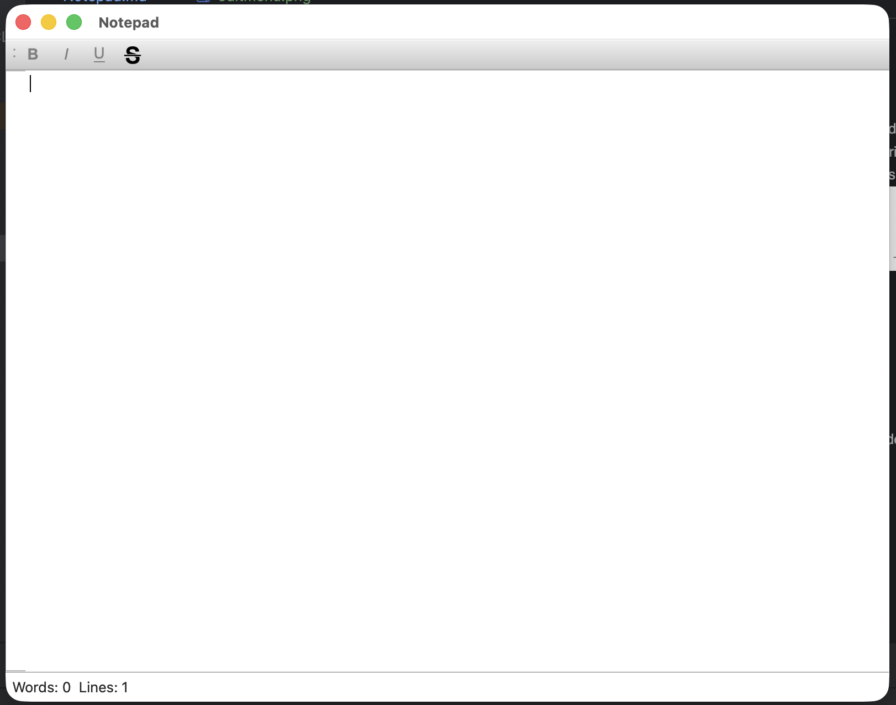
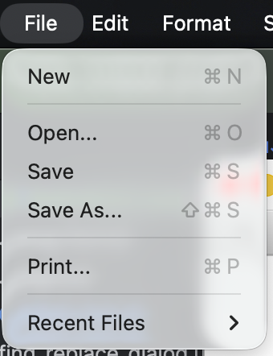
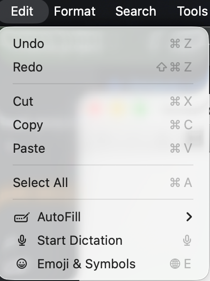
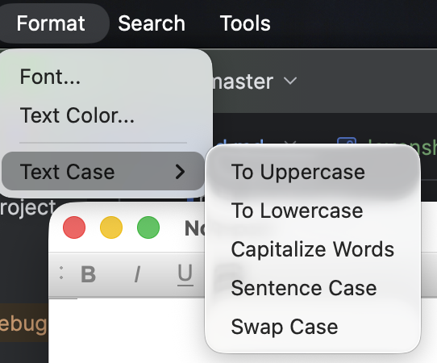
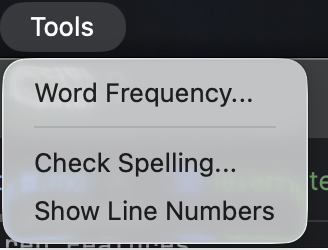
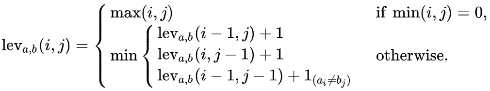

## Program Overview

### Main Window. Title
- Changes to the filename

### Main Window. Toolbar:
- Lets user choose the transformations:
  - Bold
  - Italic
  - Underline
  - Strikethrough (new, extra)
- Applies to selected text

### File Menu:
- New: "Create" a new file via resetting the title, etc.
  - Exception Handling implemented through open/save functions
- Open: Open a file via native
- Save/Save as: Saves the file via native
- Print: Opens a QPrintDialog (Optional Feature)
- Recent Files: Shows up to 5 previously saved/opened files and has an option of resetting the list (Optional Feature)

### Edit Menu:
- Undo/Redo

### Format Menu:
- Font: Prompts user to choose font, applies to selected text (Optional Feature)
- Text Color: Prompts user to choose a color, applies to selected text (Optional Feature)
- Text Case: Prompts user to pick transformations, applies to selected text

### Tools Menu:
- Word Frequency: Pops up a window showing frequency of written words in the text
- Check Spelling: Runs a spell check and shows, if there are any, misspellings (Required Feature)
- Show Line Numbers: Toggles a line numbers area visibility (Optional Feature)

### Note:
- Spell checker compares levenshtein distances of a written word with words from words.txt (fetched from origin), highlights calculated out-of-dictionary words and suggests possible words.

- Strikethrough toolbar toggle implemented, 'strikethrough.svg' taken under CC0 license